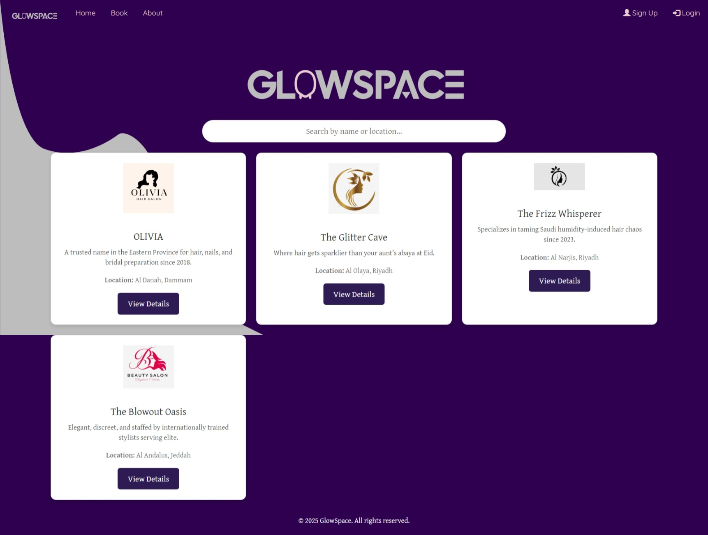
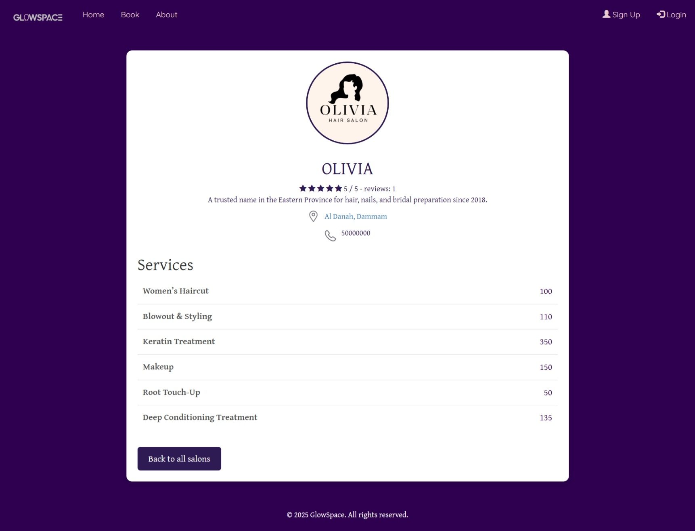
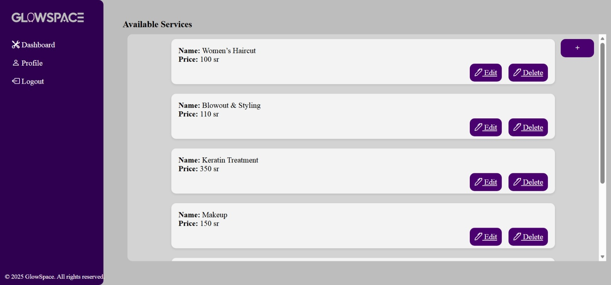
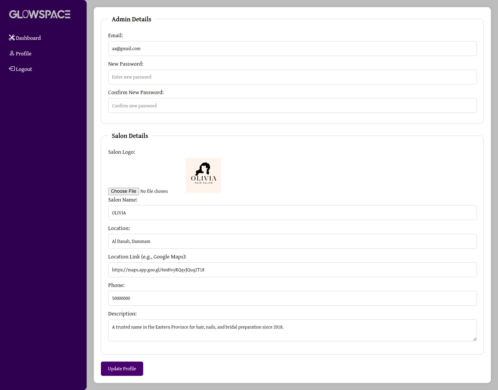

# Web-Project

# GlowSpace Overview🌟

**GlowSpace**  is a web platform that connects users with the top beauty salons in Riyadh. It provides an intuitive and user-friendly experience for discovering salons, show their rates, and exploring their services. The platform also features an admin panel for salon owners to manage their information, services.

## Setup
To set up and run the project locally, follow these steps:
1.	Clone the Repository
-  `git clone https://github.com/Nada-Alsultan/Web-Project.git `
-  `cd Web-Project `
2.	Install Dependencies
-  `npm install `
3.	Setup MongoDB Database
- Ensure MongoDB is installed and running on  `mongodb://0.0.0.0:27017/glowspace `
4.	Run the Application
- `npm start `
5.	Access the Website 
- Open  `http://localhost:3001 ` in your browser.

## Technologies Used
- Frontend: ejs, CSS
- Backend: Node.js, Express.js
- Database: MongoDB

## Goals
- Provide an easy-to-use browing system for salons.
- Allow users to explore salon services and contact details.
- Enable salon owners to manage their business efficiently.
- Implement a user-friendly interface with a responsive design.

## Screenshots
- Home Page
  
- Salon Profile
  
- About
  
- Log in
  
- Salon dashboard
  
- Salon Profile edit
  

## Future Work
- Implement booking services for each salon with time schedule.
- Implement payment integration for prepaid bookings.
- Develop a mobile application for better accessibility.
- Allow user comment reviews with policy for salons.
- Improve filtering options.

## Resources
- [MongoDB Documentation](https://www.mongodb.com/docs/)
- [Express.js Guide](https://expressjs.com/)
- [React.js Documentation](https://legacy.reactjs.org/docs)

